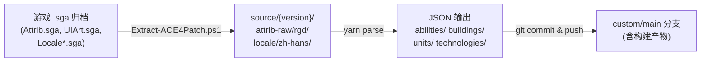

# 完整更新流程：解包 → 同步 → 构建 → 发布

本文档记录了从游戏文件解包原始数据、同步上游代码、构建 JSON 产物、到发布 `custom/main` 的完整操作流程。

## 数据管线总览



---

## 前置条件

### 必需工具

| 工具 | 用途 | 安装方式 |
|------|------|----------|
| .NET Runtime 6.0 | 运行 AOEMods.Essence 解包工具 | https://dotnet.microsoft.com/zh-cn/download/dotnet/6.0 |
| AOEMods.Essence | 解包 .sga 游戏归档文件 | https://github.com/aoemods/AOEMods.Essence/releases |
| Node.js + Yarn | 运行 `yarn parse` 构建脚本 | `corepack enable` / `npm install -g yarn` |

### 游戏路径

以下假设游戏安装在 Steam 默认路径。请根据实际情况修改 `$GamePath` 变量：

```powershell
$GamePath = 'D:\SteamLibrary\steamapps\common\Age of Empires IV'
```

### Git 远程与别名（仅首次配置）

```bash
git remote add upstream https://github.com/aoe4world/data.git
git config --local pull.ff only
git config --local rerere.enabled true
git config --local alias.sync-upstream "!git fetch upstream && git switch main && git merge --ff-only upstream/main && git push origin main"
git config --local alias.refresh-custom "!git switch custom/main && git merge main && git push origin custom/main"
```

### 首次配置 AOEMods.Essence

从 [AOEMods.Essence Releases](https://github.com/aoemods/AOEMods.Essence/releases) 下载最新版，解压到 `./source/AOEMods.Essence/`，确保存在：

```
./source/AOEMods.Essence/AOEMods.Essence.CLI.dll
```

---

## 完整操作流程

### 第 1 步：解包游戏原始数据

以**管理员**身份打开 PowerShell，进入项目目录，设置执行策略：

```powershell
cd C:\Users\liumin\Documents\aoe4\aoe4data
Set-ExecutionPolicy -ExecutionPolicy Bypass -Scope Process
```

运行解包脚本，从游戏目录提取属性、UI 等原始数据到 `source/{version}/`：

```powershell
$GamePath = 'D:\SteamLibrary\steamapps\common\Age of Empires IV'
.\Extract-AOE4Patch.ps1 -GamePath $GamePath
```

> 执行完毕后，`source/latest` 将指向最新版本目录，其中包含 `attrib-raw/rgd/`、`ui/` 等子目录。

### 第 2 步：解包中文语言文件

复制游戏中的简体中文语言包，并解包翻译数据：

```powershell
# 复制语言文件
Copy-Item "$GamePath\cardinal\archives\LocaleSimplifiedChinese.sga" -Destination ".\source\LocaleSimplifiedChinese.sga"

# 解包翻译到 source/locale/
dotnet ./source/AOEMods.Essence/AOEMods.Essence.CLI.dll sga-unpack ./source/LocaleSimplifiedChinese.sga ../source/locale

# 移动到 latest 目录下
Move-Item -Path ".\source\locale\zh-hans" -Destination ".\source\latest\locale\" -Force
```

### 第 3 步：同步上游代码

```bash
git sync-upstream
```

等价于手动执行：

```bash
git fetch upstream
git switch main
git merge --ff-only upstream/main
git push origin main
```

### 第 4 步：将 feature 分支变基到最新 main

```bash
git switch feature/zh-hans-localized-fields
git rebase main
```

#### 如果出现冲突

1. 查看冲突文件，手动解决（保留你的自定义改动）：
   ```bash
   git checkout --theirs -- <conflicted-file>
   ```
2. 标记已解决并继续：
   ```bash
   git add <resolved-file>
   git rebase --continue
   ```

> 由于已启用 `rerere`，同类冲突下次可能自动复用之前的解决方案。

### 第 5 步：推送更新后的 feature 分支

```bash
git push --force-with-lease origin feature/zh-hans-localized-fields
```

### 第 6 步：重建 custom/main 并构建

```bash
# 删除旧 custom/main
git branch -D custom/main
git push origin --delete custom/main

# 从当前 feature 分支创建新的 custom/main
git switch -c custom/main
git push origin custom/main
```

### 第 7 步：执行构建并发布

```bash
# 运行构建（解析 source/ 中的原始数据，生成 JSON）
yarn parse

# 提交构建产物并推送
git add -A
git commit -m "build: update data files from upstream sync"
git push origin custom/main
```

### 第 8 步：回到 feature 分支

```bash
git switch feature/zh-hans-localized-fields
```

---

## 快速一键执行（无冲突时）

将以下脚本保存为 `.ps1` 文件，以管理员身份运行。注意修改 `$GamePath` 为实际路径：

```powershell
# 设置
$GamePath = 'D:\SteamLibrary\steamapps\common\Age of Empires IV'
Set-ExecutionPolicy -ExecutionPolicy Bypass -Scope Process

# --- 第1步：解包游戏原始数据 ---
.\Extract-AOE4Patch.ps1 -GamePath $GamePath

# --- 第2步：解包中文语言文件 ---
Copy-Item "$GamePath\cardinal\archives\LocaleSimplifiedChinese.sga" -Destination ".\source\LocaleSimplifiedChinese.sga" -Force
dotnet ./source/AOEMods.Essence/AOEMods.Essence.CLI.dll sga-unpack ./source/LocaleSimplifiedChinese.sga ../source/locale
Move-Item -Path ".\source\locale\zh-hans" -Destination ".\source\latest\locale\" -Force

# --- 第3-8步：Git 同步、构建、发布 ---
git sync-upstream
git switch feature/zh-hans-localized-fields
git rebase main
git push --force-with-lease origin feature/zh-hans-localized-fields
git branch -D custom/main
git push origin --delete custom/main
git switch -c custom/main
git push origin custom/main
yarn parse
git add -A
git commit -m "build: update data files from upstream sync"
git push origin custom/main
git switch feature/zh-hans-localized-fields
```

---

## 仅同步代码（不重新解包）

如果游戏没有更新，只需要同步上游代码变更并重建构建产物，可以跳过第1-2步：

```bash
git sync-upstream && ^
git switch feature/zh-hans-localized-fields && ^
git rebase main && ^
git push --force-with-lease origin feature/zh-hans-localized-fields && ^
git branch -D custom/main && ^
git push origin --delete custom/main && ^
git switch -c custom/main && ^
git push origin custom/main && ^
yarn parse && ^
git add -A && ^
git commit -m "build: update data files from upstream sync" && ^
git push origin custom/main && ^
git switch feature/zh-hans-localized-fields
```

---

## 分支结构说明

```
main  ─────────────────────── 最新上游 (aoe4world/data)
                              └── feature/zh-hans-localized-fields
                                   ├── 中文显示类别字段
                                   ├── 中文名称/描述处理
                                   ├── 本地化字段支持
                                   └── ...
custom/main ──────────────── 与 feature/zh-hans-localized-fields 相同（含 build 产物）
```
